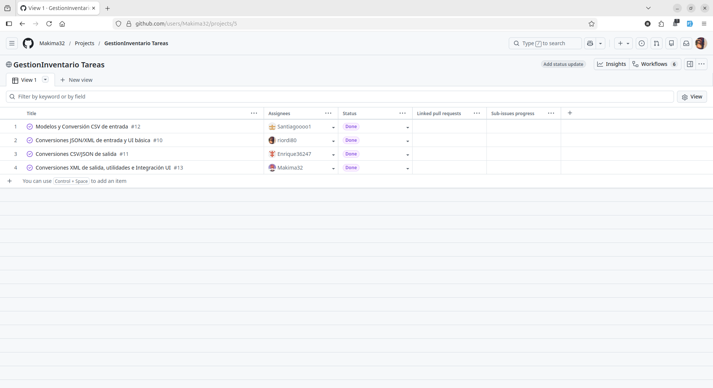
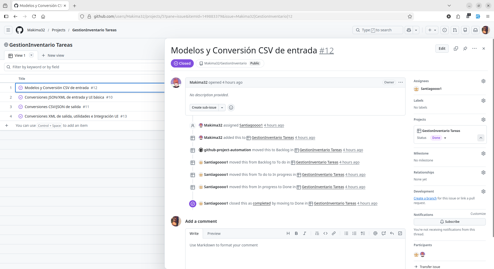
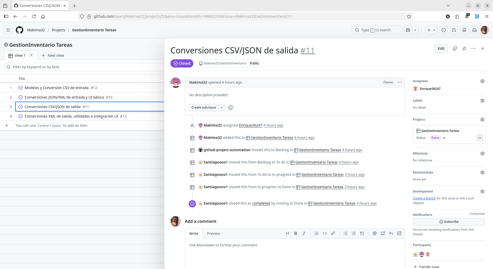
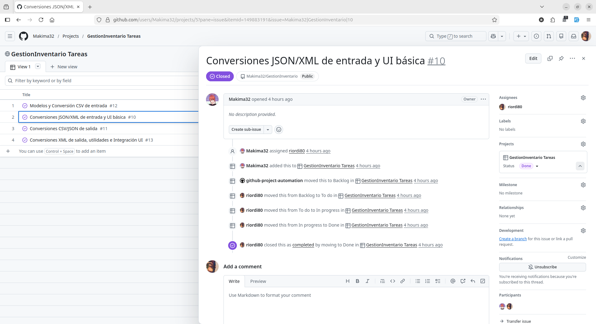
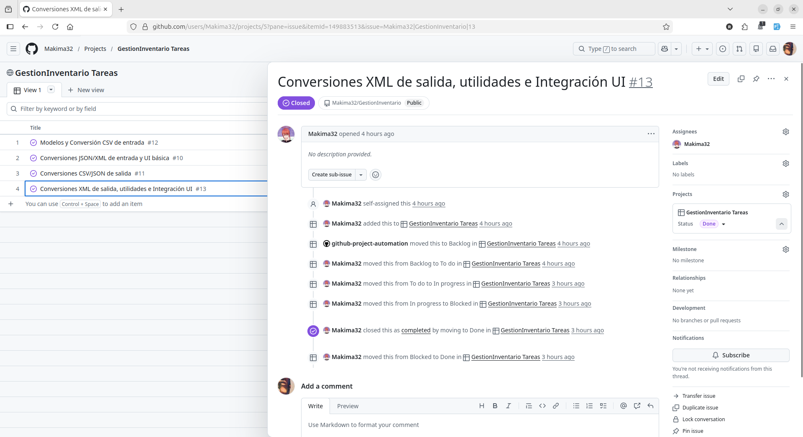

# Distribución del Trabajo - Gestión de Inventario

## Índice

- [1. Santiago - Modelos y Conversión CSV de entrada](#santiago---modelos-y-conversión-csv-de-entrada)
- [2. Enrique - Conversiones CSV/JSON de salida](#enrique---conversiones-csvjson-de-salida)
- [3. Richard - Conversiones JSON/XML de entrada y UI básica](#richard---conversiones-jsonxml-de-entrada-y-ui-básica)
- [4. Omar - Conversiones XML de salida, utilidades e Integración UI](#omar---conversiones-xml-de-salida-utilidades-e-integración-ui)
- [5. Resumen de Líneas de Código](#resumen-de-líneas-de-código)
- [6. Tecnologías Utilizadas](#tecnologías-utilizadas)
- [7. Arquitectura del Proyecto](#arquitectura-del-proyecto)
- [8. Funcionalidades Implementadas](#funcionalidades-implementadas)
- [9. Gestión del Proyecto en GitHub](#gestión-del-proyecto-en-github)

---

## 1. [SANTIAGO] - Modelos y Conversión CSV de entrada
**Responsabilidad:** Capa de datos y conversión CSV→Objetos

### Archivos desarrollados:
- `src/main/java/com/mycompany/models/Producto.java`
- `src/main/java/com/mycompany/models/ListaProductos.java`
- `src/main/java/com/mycompany/controller/CsvAObjeto.java`

### Descripción del trabajo:
Diseño de los modelos de datos principales del sistema. La clase `Producto` incluye los atributos nombre, cantidad, precio y categoría, implementando `Serializable` para permitir persistencia en archivos binarios .dat y usando anotaciones JAXB (`@XmlRootElement`) para serialización XML.

Wrapper `ListaProductos` con anotaciones JAXB completas (`@XmlRootElement`, `@XmlElement`) que permite empaquetar una lista de productos para marshalling/unmarshalling XML.

Conversor `CsvAObjeto` con un método público `convertir()` que lee archivos CSV línea por línea usando `BufferedReader`, parsea cada línea (formato: Nombre,Cantidad,Precio,Categoria) y retorna una lista de objetos `Producto`. El método incluye validación de formato y manejo de excepciones. También incluye un método `main()` para ejecutar la conversión de forma independiente.

---

## 2. [ENRIQUE] - Conversiones CSV/JSON de salida
**Responsabilidad:** Conversores Objetos→CSV y JSON→Objetos

### Archivos desarrollados:
- `src/main/java/com/mycompany/controller/ObjetoACsv.java`
- `src/main/java/com/mycompany/controller/JsonAObjeto.java`

### Descripción del trabajo:
Creación de `ObjetoACsv` que convierte una lista de productos a formato CSV. El método `convertir()` recibe la lista y la ruta del archivo, usando `PrintWriter` con try-with-resources para escribir cada producto en formato CSV (campos separados por comas). Incluye método `main()` para conversión independiente.

`JsonAObjeto` que lee archivos JSON y los convierte en objetos Producto. Utiliza la librería Gson con `TypeToken<List<Producto>>` para deserializar correctamente listas genéricas. El método `convertir()` retorna una lista de productos, manejando casos de JSON vacío retornando una lista vacía en lugar de null. Usa try-with-resources para cerrar automáticamente el `FileReader`.

---

## 3. [RICHARD] - Conversiones JSON/XML de entrada y UI básica
**Responsabilidad:** Conversores de salida JSON/XML y componentes de interfaz

### Archivos desarrollados:
- `src/main/java/com/mycompany/controller/ObjetoAJson.java`
- `src/main/java/com/mycompany/controller/XmlAObjeto.java`
- `src/main/java/com/mycompany/view/ProductoTableModel.java`
- `src/main/java/com/mycompany/view/ProductoDialog.java`

### Descripción del trabajo:
Desarrollo de `ObjetoAJson` que serializa listas de productos a formato JSON usando Gson. El método usa try-with-resources con `FileWriter`. También se desarrolló `XmlAObjeto` que usa JAXB Unmarshaller para leer archivos XML, deserializando el wrapper `ListaProductos` y extrayendo la lista de productos.

Modelo personalizado de la tabla (`ProductoTableModel`) extendiendo `AbstractTableModel`. Implementa toda la lógica de sincronización entre la lista de productos en memoria y la visualización, con métodos CRUD completos: `addProducto()`, `removeProducto()`, `setProductos()`, `getProductos()`.

Validación en tiempo real en `setValueAt()`: validación de tipos (int para cantidad, double para precio), restricciones de valores no negativos, y campos no vacíos. Los errores se notifican mediante `JOptionPane`.

Diálogo modal `ProductoDialog` con formulario de 4 campos para añadir productos, con validación de cada campo, soporte para teclas Enter/Escape y focus management.

---

## 4. [OMAR] - Conversiones XML de salida, utilidades e Integración UI
**Responsabilidad:** Conversor XML, helpers y ventana principal

### Archivos desarrollados:
- `src/main/java/com/mycompany/controller/ObjetoAXml.java`
- `src/main/java/com/mycompany/controller/LeerDatos.java`
- `src/main/java/com/mycompany/controller/DatHelper.java`
- `src/main/java/com/mycompany/view/InventarioFrame.java`
- `src/main/java/com/mycompany/gestioninventario/GestionInventario.java`

### Descripción del trabajo:
Implementación de `ObjetoAXml` que usa JAXB Marshaller para convertir listas de productos a XML. El método empaqueta la lista en el wrapper `ListaProductos`, configura formato legible (`JAXB_FORMATTED_OUTPUT`), y serializa a archivo.

`DatHelper`, clase auxiliar con métodos estáticos para operaciones con archivos binarios: `cargar()` y `guardar()`. Usa `ObjectInputStream`/`ObjectOutputStream` con manejo de recursos automático.

`LeerDatos`, utilidad para leer y mostrar productos desde archivos DAT de forma formateada, útil para debugging y verificación.

Interfaz principal (`InventarioFrame`) que integra todos los componentes. Layout con `BorderLayout`: `JToolBar` en NORTH con 4 botones, tabla con scroll en CENTER. Tabla con renderizadores personalizados: formato de precio con símbolo €, alineación de columnas numéricas, ancho óptimo de columnas.

4 funcionalidades principales:

- **Abrir:** Usa `JFileChooser` con filtros, detecta formato por extensión, llama a los conversores correspondientes (`CsvAObjeto.convertir()`, `JsonAObjeto.convertir()`, etc.)
- **Guardar:** Selector con filtros por tipo, añade extensión automática, llama a conversores de salida (`ObjetoACsv.convertir()`, `ObjetoAJson.convertir()`, etc.)
- **Añadir:** Abre `ProductoDialog`, añade a tabla con `tableModel.addProducto()`
- **Eliminar:** Confirmación con `JOptionPane`, elimina con `tableModel.removeProducto()`

Manejo de errores con mensajes claros.

`GestionInventario` como punto de entrada, configurando Look and Feel del sistema y lanzando la GUI en el Event Dispatch Thread.

---

## 5. Resumen de Líneas de Código

| Compañero | Archivos | Controllers |
|-----------|----------|-------------|
| Santiago | 3 | 1 |
| Enrique | 2 | 2 |
| Richard | 4 | 2 |
| Omar | 5 | 3 |

---

## 6. Tecnologías Utilizadas

- **Java SE 17+**
- **Swing** - Interfaz gráfica (JFrame, JTable, JDialog, JFileChooser)
- **JAXB** - Marshalling/Unmarshalling XML
- **Gson** - Procesamiento JSON
- **Java I/O** - Lectura/escritura de archivos (BufferedReader, FileWriter, PrintWriter)
- **Java Serialization** - Archivos binarios .dat
- **Maven** - Gestión de dependencias

---

## 7. Arquitectura del Proyecto

```
com.mycompany
├── models/              [Santiago]
│   ├── Producto
│   └── ListaProductos
├── controller/
│   ├── CsvAObjeto       [Santiago]
│   ├── ObjetoACsv       [Enrique]
│   ├── JsonAObjeto      [Enrique]
│   ├── ObjetoAJson      [Richard]
│   ├── XmlAObjeto       [Richard]
│   ├── ObjetoAXml       [Omar]
│   ├── LeerDatos        [Omar]
│   └── DatHelper        [Omar]
├── view/
│   ├── ProductoTableModel      [Richard]
│   ├── ProductoDialog          [Richard]
│   └── InventarioFrame         [Omar]
└── gestioninventario/
    └── GestionInventario (Main) [Omar]
```

---

## 8. Funcionalidades Implementadas

### Conversiones de Formato
- CSV ↔ Objetos
- JSON ↔ Objetos
- XML ↔ Objetos
- DAT (binario) ↔ Objetos

### Interfaz Gráfica
- Tabla editable con validación
- Abrir archivos en cualquier formato
- Guardar en cualquier formato con nombre personalizado
- Añadir productos con formulario validado
- Eliminar productos con confirmación
- Formato visual: precio con €, columnas alineadas

### Características Técnicas
- Rutas relativas (multiplataforma)
- Manejo robusto de excepciones
- Try-with-resources para cierre automático
- Métodos reutilizables en controllers
- Cada controller ejecutable independientemente (main propio)

---

## 9. Gestión del Proyecto en GitHub

Se ha utilizado GitHub Projects para la gestión y seguimiento de tareas del proyecto.

### Vista global del proyecto



### Tareas por colaborador

**Tarea de Santiago:**



**Tarea de Enrique:**



**Tarea de Richard:**



**Tarea de Omar:**


